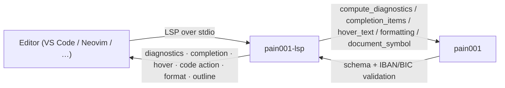

<!-- SPDX-License-Identifier: Apache-2.0 -->

<p align="center">
  
</p>

<h1 align="center">pain001-lsp</h1>

<p align="center">
  <b>Language Server Protocol server for authoring pain001 ISO 20022 payment-data JSON files.</b>
</p>

<p align="center">
  <a href="https://pypi.org/project/pain001-lsp/"></a>
  <a href="https://pypi.org/project/pain001-lsp/"></a>
  <a href="https://pypi.org/project/pain001-lsp/"></a>
  <a href="https://github.com/sebastienrousseau/pain001-lsp/actions/workflows/ci.yml"></a>
  <a href="https://github.com/sebastienrousseau/pain001-lsp/actions/workflows/ci.yml"></a>
  <a href="#license"></a>
</p>

---

## Contents

**Getting started**

- [What is pain001-lsp?](#what-is-pain001-lsp) — the problem it solves
- [Install](#install) — PyPI, virtualenv, Docker
- [Quick start](#quick-start) — wire it to your editor in 60 seconds

**Library reference**

- [Features](#features) — six LSP features as you type
- [Editor wiring](#editor-wiring) — Neovim, VS Code, Helix, generic
- [Using the helpers](#using-the-helpers) — call the diagnostic engine from Python
- [The pain001 suite](#the-pain001-suite) — core lib, MCP server, LSP server

**Operational**

- [When not to use pain001-lsp](#when-not-to-use-pain001-lsp) — honest boundaries
- [Development](#development) — gates, make targets
- [Security](#security) — sandboxing posture
- [Documentation](#documentation) — examples, guides
- [Contributing](#contributing) — how to get changes in
- [License](#license) — Apache-2.0

---

## What is pain001-lsp?

A **Language Server** speaks the
[Language Server Protocol (LSP)](https://microsoft.github.io/language-server-protocol/) —
the editor-agnostic protocol that lets a single backend deliver
diagnostics, completion, hover, code actions, formatting, and document
symbols to any LSP client (VS Code, Neovim, Helix, Emacs, …).
**pain001-lsp** is that backend for **payment-data JSON files**: the
JSON arrays of flat payment records that drive ISO 20022 `pain.001`
message generation in the
[`pain001`](https://github.com/sebastienrousseau/pain001) suite.

Every feature is backed by the `pain001` public API, so editor
behaviour stays in lockstep with the CLI, REST API, and MCP server.

| Concern | How pain001-lsp handles it |
| :--- | :--- |
| Schema validation | Each record validated against the message type's input JSON Schema |
| Identifier validation | `debtor_account_IBAN`, `creditor_account_IBAN`, `*_BIC`, etc. validated as IBAN/BIC |
| Completion | Every input field with its schema description + every supported message type |
| Hover | Schema descriptions for the field under the cursor |
| Code actions | One-click "add missing required fields" with type-appropriate placeholders |
| Formatting | Two-space, ISO 20022 Latin-clean JSON pretty-print; idempotent (no edits when already formatted) |
| Outline | One `DocumentSymbol` per top-level record (named by `id`, detail = `payment_id`) |
| Multi-record | Code actions target the record under the cursor, not just the first |
| Live re-config | `workspace/didChangeConfiguration` switches the active message type without restart |

---

## Install

| Channel | Command | Notes |
| :--- | :--- | :--- |
| PyPI | `pip install pain001-lsp` | Pulls in `pain001 >= 0.0.53` + `pygls` |
| Source | `git clone https://github.com/sebastienrousseau/pain001-lsp && cd pain001-lsp && poetry install` | For development |
| Docker (GHCR) | `docker pull ghcr.io/sebastienrousseau/pain001-lsp:latest` | Multi-arch (linux/amd64, linux/arm64); runs `pain001-lsp` over stdio |

Requires Python 3.10 or later. Works on macOS, Linux, and Windows.

Verify the installation:

```sh
python -c "import pain001_lsp; print('pain001-lsp', pain001_lsp.__version__)"
# -> pain001-lsp 0.0.53
```

<details>
<summary>Using an isolated virtual environment (recommended)</summary>

```sh
python -m venv venv
source venv/bin/activate        # macOS/Linux
venv\Scripts\activate           # Windows
python -m pip install -U pain001-lsp
```

</details>

---

## Quick start

The package installs a `pain001-lsp` console entry point that starts
the language server over **stdio**:

```sh
pain001-lsp
# -> (waiting on stdin for LSP JSON-RPC)
```

The command speaks LSP on stdin/stdout — it is meant to be launched by
your editor's LSP client, not used interactively. Wire it up
([Editor wiring](#editor-wiring)) and open any pain.001 payment-data
JSON file; diagnostics, completion, hover, formatting, and the outline
pane all light up as you type.

---

## Features

For payment-data JSON files (a JSON array of flat records, or a single
record object treated as one record):

| LSP method | Behaviour |
| :--- | :--- |
| `textDocument/publishDiagnostics` | Schema + IBAN/BIC validation on open and on every change; malformed JSON yields a single syntax diagnostic at the offending position |
| `textDocument/completion` | Every input field (description as detail) + every supported `pain.001` / `pain.008` message type |
| `textDocument/hover` | Schema `description` for the field under the cursor |
| `textDocument/codeAction` | "Add missing required fields" quick-fix on the record under the cursor, with type-appropriate placeholders (`""`, `0`, `false`, `[]`, `{}`) |
| `textDocument/formatting` | Two-space JSON pretty-print with a trailing newline; idempotent (returns no edits when already formatted); leaves malformed JSON untouched so diagnostics still surface the error |
| `textDocument/documentSymbol` | One `DocumentSymbol` per top-level record so editors populate the outline pane, jump-to-record, and code-fold individual records (name = `id`, detail = `payment_id`) |

The default message type is `pain.001.001.09` (Customer Credit Transfer
Initiation V09). Override per-workspace at startup with
`initializationOptions: {"messageType": "pain.001.001.11"}`, or
hot-swap at runtime via `workspace/didChangeConfiguration` with
`{"pain001": {"messageType": "pain.001.001.11"}}`.

The feature logic lives in pure, importable helpers
(`compute_diagnostics`, `completion_items`, `hover_text`,
`missing_required_fields`, `build_insert_text`,
`_record_close_positions`, `_normalise_records`); the LSP handlers are
thin glue that map plain dicts to `lsprotocol` types.

---

## Editor wiring

Register `pain001-lsp` as the server `cmd` for JSON files in your
editor's LSP client.

<details>
<summary>Neovim (built-in <code>vim.lsp.config</code>)</summary>

```lua
vim.lsp.config["pain001"] = {
  cmd = { "pain001-lsp" },
  filetypes = { "json" },
  root_markers = { ".git" },
  init_options = { messageType = "pain.001.001.09" },
}
vim.lsp.enable("pain001")
```

</details>

<details>
<summary>VS Code (bundled scaffold)</summary>

A TypeScript language-client scaffold ships at
[`editors/vscode/`](editors/vscode/) — runnable straight from source:

```bash
cd editors/vscode
npm install
npm run compile
# Press F5 in VS Code to launch an Extension Development Host.
```

`pain001.serverCommand` (default `pain001-lsp`) and `pain001.messageType`
(default `pain.001.001.09`) are exposed as settings.

</details>

<details>
<summary>Helix / Emacs / generic LSP</summary>

Any client that can spawn a stdio language server will work. The
command is `pain001-lsp`, the filetype is `json`, and
`initializationOptions` accepts `{"messageType": "..."}`.

</details>

---

## Using the helpers

Because the feature logic is pure, you can call it directly — no editor
or server process required. This is exactly what the server runs on each
edit:

```python
import json

from pain001_lsp.server import (
    completion_items,
    compute_diagnostics,
    hover_text,
    missing_required_fields,
)

# Minimal valid record (the schema accepts these required fields).
valid_record = {
    "id": "MSG-0001",
    "date": "2026-01-15T10:30:00",
    "nb_of_txs": 1,
    "ctrl_sum": 100.00,
    "initiator_name": "Acme Embedded Finance Ltd",
    "payment_information_id": "PMT-INFO-0001",
    "payment_method": "TRF",
    "batch_booking": False,
    "service_level_code": "SEPA",
    "requested_execution_date": "2026-01-20",
    "debtor_name": "Acme Embedded Finance Ltd",
    "debtor_account_IBAN": "DE89370400440532013000",
    "debtor_agent_BIC": "DEUTDEFFXXX",
    "charge_bearer": "SLEV",
    "payment_id": "PAY-0001",
    "payment_amount": 100.00,
    "currency": "EUR",
    "creditor_agent_BIC": "NWBKGB2LXXX",
    "creditor_name": "National Westminster Bank",
    "creditor_account_IBAN": "GB29NWBK60161331926819",
    "remittance_information": "Invoice 0001",
}

# 1. A complete record produces no diagnostics.
assert compute_diagnostics(json.dumps([valid_record])) == []

# 2. Missing required fields surface as errors.
diagnostics = compute_diagnostics(json.dumps([{"id": "ONLY-ID"}]))
print(len(diagnostics), "issue(s)")
# -> e.g. "5 issue(s)"

# 3. An invalid IBAN is flagged.
print(compute_diagnostics(
    json.dumps([{"debtor_account_IBAN": "INVALID"}])
)[:1])
# -> [{"line": ..., "character": ..., "severity": "warning",
#      "message": "debtor_account_IBAN: invalid IBAN"}]

# 4. Quick-fix data: list missing fields, render insertion text.
missing = missing_required_fields({"id": "ONLY-ID"})
print(missing[:3])  # -> e.g. ['date', 'nb_of_txs', 'ctrl_sum']

# 5. Completion + hover.
items = completion_items()
print(len(items), "items, first:", items[0]["label"])
# -> e.g. "47 items, first: id"
print(hover_text("debtor_account_IBAN"))
# -> the field's schema description
print(hover_text("nope"))
# -> None
```

Each diagnostic is a plain dict —
`{"line": int, "character": int, "severity": "error"|"warning", "message": str}` —
which the server maps to `lsprotocol.Diagnostic` before publishing.

The runnable version of this snippet lives in
[`examples/01_lsp_helpers.py`](examples/01_lsp_helpers.py). See also
[`02_quick_fix.py`](examples/02_quick_fix.py) (the code-action surface)
and [`03_configure_message_type.py`](examples/03_configure_message_type.py)
(overriding the default message type via `initializationOptions`).

---

## The pain001 suite

`pain001-lsp` is part of a set of independently installable packages
built around the [`pain001`](https://github.com/sebastienrousseau/pain001)
library — pick whichever ones your stack needs:

| Package | Role |
| :--- | :--- |
| [`pain001`](https://pypi.org/project/pain001/) | Core library + CLI + FastAPI REST API |
| [`pain001-mcp`](https://pypi.org/project/pain001-mcp/) | Model Context Protocol server (for AI agents) |
| [`pain001-lsp`](https://pypi.org/project/pain001-lsp/) | **Language Server Protocol server (this package)** |



---

## When not to use pain001-lsp

- **You're not editing JSON payment data.** The server targets the
  JSON record format consumed by the `pain001` generator; if you're
  authoring the underlying XML directly, use a generic XSD-aware
  language server.
- **You need CSV diagnostics in the editor.** The CSV diagnostic engine
  ships in-tree under [`pain001[lsp]`](https://github.com/sebastienrousseau/pain001)
  (`pain001-lsp-builtin`); this standalone server focuses on the
  richer JSON surface.
- **You want agent tools, not editor diagnostics.** Use
  [`pain001-mcp`](https://pypi.org/project/pain001-mcp/) — it speaks
  the Model Context Protocol to AI assistants.

---

## Development

`pain001-lsp` uses [Poetry](https://python-poetry.org/) and
[mise](https://mise.jdx.dev/).

```bash
git clone https://github.com/sebastienrousseau/pain001-lsp.git
cd pain001-lsp
mise install
poetry install
```

A `Makefile` orchestrates the quality gates (kept in lockstep with CI):

| Target | What it runs |
| :--- | :--- |
| `make check` | All gates (REQUIRED before commit) |
| `make test` | `pytest --cov=pain001_lsp --cov-branch --cov-fail-under=100` |
| `make lint` | `ruff check` + `ruff format --check` |
| `make type-check` | `mypy --strict` |
| `make examples` | Run the three example scripts |

Current state (v0.0.53): **81 tests passing, 100% line + branch
coverage** against a 100% enforced floor, mypy `--strict` clean,
interrogate 100% docstring coverage.

---

## Security

- **No filesystem writes.** The server reads from the editor's
  in-memory document buffer; no scratch files, no temp directories.
- **JSON parsing** uses the stdlib `json` module on already-quoted text
  from the editor — no `eval`, no shelling out, no XML.
- **Validation failures** are returned as `lsprotocol.Diagnostic`
  objects with no stack traces, so the editor never sees an internal
  path or exception message.
- **Dependencies** are pinned via `poetry.lock` and audited by
  `pip-audit` and Bandit in CI.

To report a vulnerability, please use
[GitHub private vulnerability reporting](https://github.com/sebastienrousseau/pain001-lsp/security)
rather than a public issue.

---

## Documentation

- **Runnable examples:** [`examples/`](https://github.com/sebastienrousseau/pain001-lsp/tree/main/examples)
- **VS Code scaffold:** [`editors/vscode/`](https://github.com/sebastienrousseau/pain001-lsp/tree/main/editors/vscode)
- **Release history:** [CHANGELOG.md](https://github.com/sebastienrousseau/pain001-lsp/blob/main/CHANGELOG.md)
- **Core library docs:** [docs.pain001.com](https://docs.pain001.com)
- **LSP specification:** [microsoft.github.io/language-server-protocol](https://microsoft.github.io/language-server-protocol/)

---

## Contributing

Contributions are welcome — see the
[contributing instructions](https://github.com/sebastienrousseau/pain001-lsp/blob/main/CONTRIBUTING.md).
Thanks to all the
[contributors](https://github.com/sebastienrousseau/pain001-lsp/graphs/contributors)
who have helped build `pain001-lsp`.

---

## License

Licensed under the [Apache License, Version 2.0](https://opensource.org/license/apache-2-0/).
Built on [pygls](https://github.com/openlawlibrary/pygls) and
[lsprotocol](https://github.com/microsoft/lsprotocol) by the
[Open Law Library](https://github.com/openlawlibrary), and on the core
[`pain001`](https://github.com/sebastienrousseau/pain001) library that
powers the validators and schemas.

Any contribution submitted for inclusion shall be licensed as above,
without additional terms.

---

<p align="center">
  <a href="https://pain001.com">pain001.com</a> ·
  <a href="https://pypi.org/project/pain001-lsp/">PyPI</a> ·
  <a href="https://github.com/sebastienrousseau/pain001-lsp">GitHub</a>
</p>
