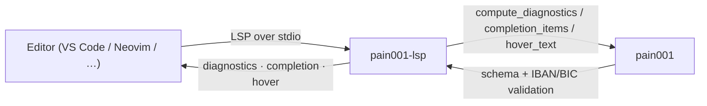

<!-- SPDX-License-Identifier: Apache-2.0 OR MIT -->

<p align="center">
  
</p>

<h1 align="center">pain001-lsp</h1>

<p align="center">
  <b>Language Server Protocol server for authoring pain001 ISO 20022 Customer Credit Transfer Initiation data files.</b>
</p>

<p align="center">
  <a href="https://pypi.org/project/pain001-lsp/"></a>
  <a href="https://pypi.org/project/pain001-lsp/"></a>
  <a href="https://pypi.org/project/pain001-lsp/"></a>
  <a href="https://github.com/sebastienrousseau/pain001-lsp/actions/workflows/ci.yml"></a>
  <a href="https://github.com/sebastienrousseau/pain001-lsp/actions/workflows/ci.yml"></a>
  <a href="#licence"></a>
</p>

---

**Real-time editor help for ISO 20022 pain.001 data files** - diagnostics,
completion, and hover as you author the JSON records that drive
`pain.001` Customer Credit Transfer Initiation message generation.

> **Latest release: v0.0.52** - a [pygls][pygls]-based Language Server with
> schema + IBAN/BIC diagnostics, field and message-type completion, and
> schema-description hover, all backed by the `pain001` public API.
> [See what's new →][release-052]

## Contents

- [Overview](#overview)
- [Install](#install)
- [Quick Start](#quick-start)
  - [Editor wiring](#editor-wiring)
- [Features](#features)
- [Using the helpers](#using-the-helpers)
- [Examples](#examples)
- [Development](#development)
- [Licence](#licence)
- [Contribution](#contribution)
- [Acknowledgements](#acknowledgements)

## Overview

A **Language Server** speaks the
[Language Server Protocol (LSP)][lsp] - the editor-agnostic protocol that
lets a single backend deliver diagnostics, completion, hover, and more to
any LSP client (VS Code, Neovim, Helix, Emacs, …). **pain001-lsp** is that
backend for **payment-data JSON files**: the JSON arrays of flat payment
records that drive ISO 20022 `pain.001` message generation in the
[`pain001`][pain001] suite.

- **Website:** <https://pain001.com>
- **Source code:** <https://github.com/sebastienrousseau/pain001-lsp>
- **Bug reports:** <https://github.com/sebastienrousseau/pain001-lsp/issues>

It gives editors four features as you type, all backed by the `pain001`
public API so they behave identically to the CLI, REST API, and MCP server:

- **Diagnostics** - each record is validated against a message type's input
  JSON Schema, and any IBAN / BIC identifier values are additionally
  checked with the dedicated validators.
- **Completion** - every input field (with its description) plus the list
  of supported `pain.001` / `pain.008` message types.
- **Hover** - the schema description for the field under the cursor.
- **Code actions** - a single quick-fix that inserts JSON `"field": …`
  lines for every schema-required field missing from the first record,
  using type-appropriate placeholders.

The intended message type defaults to `pain.001.001.09` (Customer Credit
Transfer Initiation V09); the pure helpers accept a `message_type` argument
so a different type can be configured. Editors can override the default
per-workspace by sending
`initializationOptions: {"messageType": "pain.001.001.11"}` when they spawn
the server.

**pain001-lsp** is part of the **pain001 suite** - a set of independently
installable packages (all Python 3.10+) built around the `pain001` library:

| Package | Role |
|---------|------|
| [`pain001`](https://pypi.org/project/pain001/) | Core library + Click CLI + FastAPI REST API |
| [`pain001-mcp`](https://pypi.org/project/pain001-mcp/) | Model Context Protocol server (for AI agents) |
| `pain001-lsp` | **Language Server Protocol server (this package)** |



## Install

**pain001-lsp** runs on macOS, Linux, and Windows and requires **Python 3.10+**
and **pip**. It pulls in the core [`pain001`][pain001] library and
[`pygls`][pygls] automatically.

```sh
python -m pip install pain001-lsp
```

Verify the installation:

```sh
python -c "import pain001_lsp; print('pain001-lsp', pain001_lsp.__version__)"
```

<details>
<summary>Using an isolated virtual environment (recommended)</summary>

```sh
python -m venv venv
source venv/bin/activate        # macOS/Linux
venv\Scripts\activate           # Windows
python -m pip install -U pain001-lsp
```
</details>

## Quick Start

The package installs a `pain001-lsp` console entry point that starts the
language server over **stdio**:

```sh
pain001-lsp
```

The command speaks LSP on stdin/stdout - it is meant to be launched by your
editor's LSP client, not used interactively. Point your editor at it for
JSON payment-data files and you get diagnostics, completion, and hover as
you type.

### Editor wiring

Register `pain001-lsp` as the server `cmd` for JSON files in your editor's
LSP client.

<details>
<summary>Neovim (built-in <code>vim.lsp.config</code>)</summary>

```lua
vim.lsp.config["pain001"] = {
  cmd = { "pain001-lsp" },
  filetypes = { "json" },
  root_markers = { ".git" },
}
vim.lsp.enable("pain001")
```
</details>

<details>
<summary>VS Code (generic LSP client)</summary>

Configure a generic LSP client extension to spawn the `pain001-lsp` command
over stdio for the `json` language, or wrap it in a small extension whose
`serverOptions` is `{ command: "pain001-lsp", transport: TransportKind.stdio }`.
</details>

Open a JSON array of payment records and the server validates each record
on open and on every change, surfaces completion for field names and
message types, and shows schema descriptions on hover.

## Features

For payment-data JSON files (a JSON array of flat payment records, or a
single record object treated as one record):

- **Diagnostics** - schema validation reports missing required fields,
  wrong types, and pattern/length violations; identifier fields
  (`debtor_account_IBAN`, `creditor_account_IBAN`, `charge_account_IBAN`,
  `debtor_agent_BIC`, `creditor_agent_BIC`, `forwarding_agent_BIC`) are
  additionally checked as IBAN / BIC. Malformed JSON yields a single syntax
  diagnostic at the offending position.
- **Completion** - every input field for the message type (with its schema
  description as the detail) plus every supported `pain.001` / `pain.008`
  message type.
- **Hover** - the schema `description` for the field name under the cursor.
- **Code actions** - `missing_required_fields(record, message_type)` lists
  the schema-required fields absent from a record; `build_insert_text(...)`
  renders type-appropriate placeholder lines (`""` for strings, `0` for
  numbers, `false` for booleans). The LSP server stitches these together
  into a single "Add missing required fields" quick-fix.

The feature logic lives in pure, importable helpers (`compute_diagnostics`,
`completion_items`, `hover_text`, `missing_required_fields`,
`build_insert_text`) backed by the `pain001` public API, so editor
behaviour stays in lockstep with the CLI, REST API, and MCP server. The
LSP handlers are thin glue that map those plain dicts to `lsprotocol`
types.

## Using the helpers

Because the feature logic is pure, you can call it directly - no editor or
server process required. This is exactly what the server runs on each edit:

```python
import json

from pain001_lsp.server import (
    completion_items,
    compute_diagnostics,
    hover_text,
)

# A complete, valid payment record produces no diagnostics.
valid_doc = json.dumps(
    [
        {
            "id": "MSG-0001",
            "date": "2026-01-15T10:30:00",
            "nb_of_txs": 1,
            "ctrl_sum": 100.00,
            "initiator_name": "Acme Embedded Finance Ltd",
            "payment_information_id": "PMT-INFO-0001",
            "payment_method": "TRF",
            "batch_booking": False,
            "service_level_code": "SEPA",
            "requested_execution_date": "2026-01-20",
            "debtor_name": "Acme Embedded Finance Ltd",
            "debtor_account_IBAN": "DE89370400440532013000",
            "debtor_agent_BIC": "DEUTDEFFXXX",
            "charge_bearer": "SLEV",
            "payment_id": "PAY-0001",
            "payment_amount": 100.00,
            "currency": "EUR",
            "creditor_agent_BIC": "NWBKGB2LXXX",
            "creditor_name": "National Westminster Bank",
            "creditor_account_IBAN": "GB29NWBK60161331926819",
            "remittance_information": "Invoice 0001",
        }
    ]
)
assert compute_diagnostics(valid_doc) == []

# Missing required fields are reported as errors.
missing = json.dumps([{"id": "ONLY-ID"}])
print(len(compute_diagnostics(missing)), "issue(s)")

# An invalid IBAN is flagged as a warning.
bad_iban = json.dumps([{"debtor_account_IBAN": "INVALID"}])
print(compute_diagnostics(bad_iban)[:1])

# Completion offers field names and message types; hover shows descriptions.
items = completion_items()
print(len(items), "completion items, e.g.", items[0]["label"])
print(hover_text("debtor_account_IBAN"))   # -> the field's schema description
print(hover_text("nope"))                  # -> None
```

Each diagnostic is a plain dict -
`{"line": int, "character": int, "severity": "error" | "warning", "message": str}` -
which the server maps to `lsprotocol` `Diagnostic` objects before publishing.

See [`examples/01_lsp_helpers.py`](examples/01_lsp_helpers.py) for the full
runnable script.

## Examples

The [`examples/`](examples/) directory contains three self-contained,
runnable scripts:

| Example | Demonstrates |
|---------|--------------|
| [`01_lsp_helpers.py`](examples/01_lsp_helpers.py) | The LSP diagnostics / completion / hover helpers |
| [`02_quick_fix.py`](examples/02_quick_fix.py) | The "Add missing required fields" code action - `missing_required_fields` + `build_insert_text` |
| [`03_configure_message_type.py`](examples/03_configure_message_type.py) | Overriding the default message type via `initializationOptions` |

```sh
git clone https://github.com/sebastienrousseau/pain001-lsp.git && cd pain001-lsp
python examples/01_lsp_helpers.py
```

## Development

**pain001-lsp** uses [Poetry](https://python-poetry.org/) and
[mise](https://mise.jdx.dev/).

```bash
git clone https://github.com/sebastienrousseau/pain001-lsp.git && cd pain001-lsp
mise install
poetry install
poetry shell
```

A `Makefile` orchestrates the quality gates (kept in lockstep with CI):

```bash
make check        # all gates (REQUIRED before commit)
make test         # pytest
make lint         # ruff + black
make type-check   # mypy --strict
make examples     # run the example script
```

## Licence

Licensed under the [Apache Licence, Version 2.0][01]. Any contribution submitted
for inclusion shall be licensed as above, without additional terms.

## Contribution

Contributions are welcome - see the [contributing instructions][04]. Thanks to
all [contributors][05].

## Acknowledgements

Built on [pygls][pygls] and [lsprotocol][lsprotocol] by the
[Open Law Library](https://github.com/openlawlibrary), and on the core
[`pain001`][pain001] library that powers the validators and schemas.

[01]: https://opensource.org/license/apache-2-0/
[04]: https://github.com/sebastienrousseau/pain001-lsp/blob/main/CONTRIBUTING.md
[05]: https://github.com/sebastienrousseau/pain001-lsp/graphs/contributors
[07]: https://pypi.org/project/pain001-lsp/
[pain001]: https://github.com/sebastienrousseau/pain001
[lsp]: https://microsoft.github.io/language-server-protocol/
[lsprotocol]: https://github.com/microsoft/lsprotocol
[pygls]: https://github.com/openlawlibrary/pygls
[release-052]: https://github.com/sebastienrousseau/pain001-lsp/releases/tag/v0.0.52
